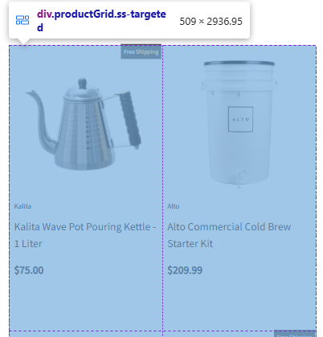
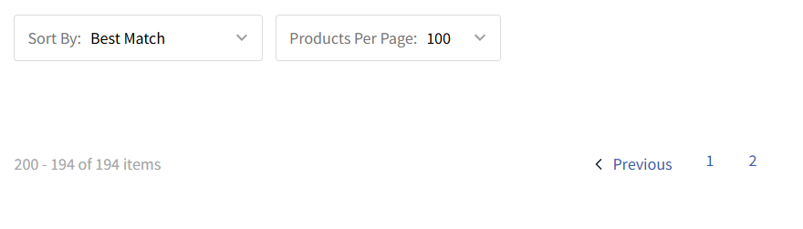
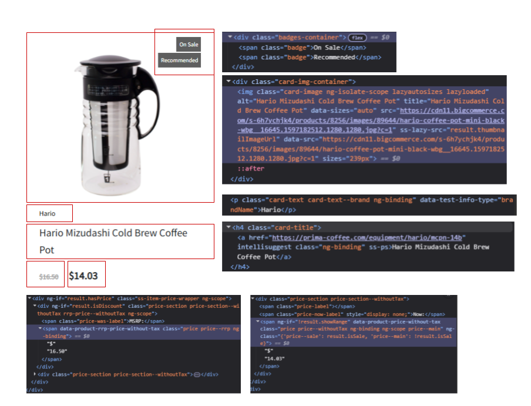

# Coffee Scraper

## Scraping Stack

## Scraping Logic

### Product Grid

From the original instructions, I know that I need to scrape all the product data from the Brew: All Coffee section. My mission, according to the instructions, is to first: write a Python script that saves all the products with their URL, title, and price, but we are going to get more information including: the brand, the badges (Free Shipping, Subscription, Recommended, On Sale, etc.), and the Sale Price if it exists.

First, we need to target the grid of products in the section, as we can see in the screenshot below:

The `div` has a class of `productGrid`, which is not a sign of any kind of dynamic class, and after further inspection, it's the only `productGrid` on the webpage, so we can safely target this grid. But we need to target the grid for all the pages.

Above the grid, inside the page, there is a *Products Per Page* controller that has a default value of 12. Let’s see how simple it is to change this product filter. Why do we want to change this product filter, you may ask? If we change the product filter to a larger size, we can make fewer requests to the webpage. For this simple exercise, it doesn’t really matter, but for a production-level scraper, fewer requests are better (in most cases). Sometimes there may be some disadvantages to this, like increased page load time or risk of hitting size/time limits on the server response, but in this case, which has no lazy scroll loading, I think it’s good to use the largest products-per-page value available. When we change to the largest, we see the URL change from:

https://prima-coffee.com/brew/coffee

to

https://prima-coffee.com/brew/coffee?products.size=100

—indicating we can control filters through the URL. In some webpages, this is not the case—there can exist dynamic URLs, where filters are applied client-side using JavaScript and do not reflect in the URL, making it harder to scrape without a headless browser. But let’s take advantage of the URL logic here.

Next, we need to make sure we’re scraping all the products, not just the first page, so we need to target all the pages. At the moment, there are only 194 items, so let’s go back to our default 12 items per page to analyze this in more detail. When we click on the second page or "Next", we see the URL change to:

https://prima-coffee.com/brew/coffee?products.from=12

If we click "Next" or the third page, we go to the link:

https://prima-coffee.com/brew/coffee?products.from=24

As you can see, the URL changes according to this formula:

https://prima-coffee.com/brew/coffee?products.from={products_per_page * previous_page}

If we go to a webpage out of range, we see an empty grid, as shown below:

At the same time, if we analyze the pagination, we see on the left the total number of items, and a page navigator that shows the first results, three dots, and the last page. There’s a "Next" button that takes us to the next page. When we reach the final page, this button disappears, and we only have the "Previous" button. So to scrape all the items, we have the following options:

1. Use the total item count to calculate the number of pages (integer division of total items by items per page). In this case: 194 items, so we have `194 // 100 = 1`, meaning we only visit the initial page and the one with `products.from=100`.

2. Visit pages until there is no "Next" button—so we visit the first page, then `products.from=100`, then `products.from=200`.

3. Visit pages until the grid is empty—same as above: first page, `products.from=100`, and then `products.from=200`.

There may be more options, but I think these are the three most efficient. Nonetheless, option one and two depend heavily on the style of the pagination navigator, which can change with any redesign. An empty grid is more tied to the webpage’s internal logic, so although option one gives a more concise limit, it can easily break with a redesign.

Finally, before planning the code, let’s decide on the information to scrape. In the following screenshot, you have an example of a product. I made a diagram that shows all the info that appears in the product card:

This corresponds to: title, price, brand, badges, sale price (if it exists), image URL, and product URL. Also, in the diagram, you can find the classes of each element, which again appear not to be dynamic, so we can use them to target the elements. Obviously, there are product cards that don’t have a sale price or badges, but I think this is very important information you want to take into account when web scraping.

### Product Price

My second mission is to enable sorting by price so the coffee shop owners can easily decide which equipment fits their budget. There are two ways you can filter by price:

1. Pre-scraping filtering: Use the webpage’s filters (in this case, URL filters) to filter the prices. This can reduce the amount of pages to scrape, and with that, the number of requests.
2. Post-scraping filtering: After scraping all the products, filter the ones in the price range (this may be with a SQL query). Although this can result in more requests, it doesn’t depend on the webpage’s filter logic. If that logic changes, the filter breaks.

I'm going to explain how to implement the first option, but option two is the one you are able to see in the Streamlit frontend.

To analyze how the filters work, it depends a lot on the webpage. Some webpages use JavaScript to filter, and this cannot be accessed through the URL because the filter is applied client-side, and the server receives no query parameter indicating the filtering—so the HTML returned remains the same. Fortunately, this is not our case. For example, let’s see what happens when we set a price range from 100 to 1000. As you can see, the URL is:

https://prima-coffee.com/brew/coffee?products.filter.0.not.0.all.0.field=availability&products.filter.0.not.0.all.0.value.0=OutOfStock&products.filter.0.not.0.all.1.field=categories&products.filter.0.not.0.all.1.value.0=Deals&products.filter.1.field=price&products.filter.1.range.0.gte=100&products.filter.1.range.0.lte=1000

In the last part, you can see there’s a:

products.filter.1.range.0.gte=100  
products.filter.1.range.0.lte=1000

This way, you can modify the values to any price range you want. Obviously, this affects the total amount of items. To go to all the pages, let’s see what happens when we go to the next page:

https://prima-coffee.com/brew/coffee?products.filter.0.not.0.all.0.field=availability&products.filter.0.not.0.all.0.value.0=OutOfStock&products.filter.0.not.0.all.1.field=categories&products.filter.0.not.0.all.1.value.0=Deals&products.filter.1.field=price&products.filter.1.range.0.gte=100&products.filter.1.range.0.lte=1000&products.from=12

Now, at the end, we have the same pagination parameter `&products.from=12`, so we can apply any of the methods we previously mentioned.

### Individual Page

